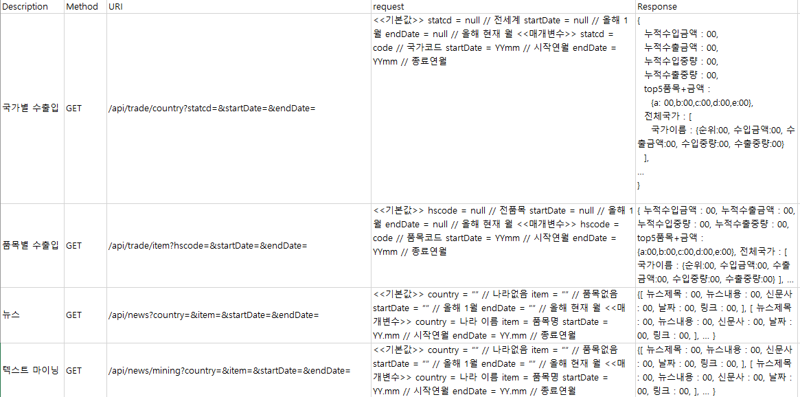
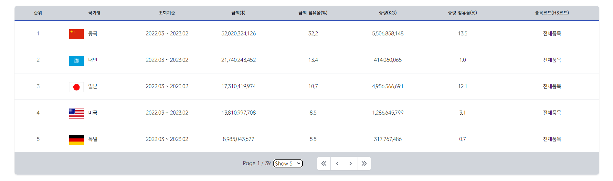

# :question: 왜 "싸피물산"을 사용해야 하나요?

## WHY
- 국내외 원부자재의 안정적 공급망 확보
- 공급 리스트 대응 전략 수립 및 수행
## HOW
- 수출입 의존도 현황 파악
- 품목, 국가별 수출입 추세 확인
- 기간별 특정 이슈에 대한 원인 확인
> <span style="color:red"><b>사전 이슈 점검 -> 안정적인 공급망 확보 -> 회사 매출 극대화</b></span>

<br />

##  ❗ 특장점

- 누적 수출입 데이터 <span style="color:red"><b>8억 개</b></span> 이상
- 신규 생성 데이터 매월 <span style="color:red"><b>650만 개</b></span> <br>

2010년 이후 ~ 현재까지, 263개 국가의 데이터

<br />

## :star2: 주요 기능

    ☝ 데이터를 시각화한 그래프를 통해 쉽게 보는 국가별 수출입 현황 및 기간 추세
    ✌ 입력한 HS CODE 기반 무역 통계 정보
    👌 기간별 핫한 무역 이슈와 관련도 순 뉴스 기사

<br />

# 배포 주소 : [🚢싸피물산](https://ssafycnt.site) : https://ssafycnt.site
<br />

## 🔨 주요 기술


<br />


<br />

### 🍏 [API 명세서](https://www.notion.so/API-831823b4daed49329c68bbb85ae15100)


<br />

### 🎇 아키텍쳐


<br />

# 📜 프로젝트 결과물





<br />

## Member & Role 👪

| 이름        | 담당 영역      |
| --------- | ---------- |
| 김관섭<br>팀장 | FrontEnd |
| 엄희원<br>   | FrontEnd |
| 장준호<br>   | FrontEnd |
| 김진희<br>   | BackEnd  |
| 김이삭<br>   | BackEnd  |
| 백승범<br>   | BackEnd  |
<br/>

```
자 이제 시작이야 내 꿈을 ~

내 꿈을 위한 여행 노인정~

걱정따윈 없어 없어!

노 인정과 함께니까

인정? 인정!
```