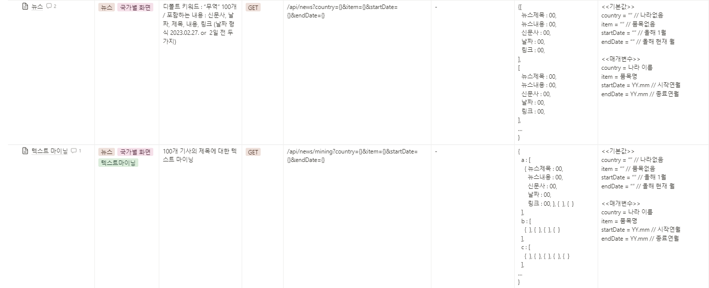

# :wave: 싸피물산

## :computer: 프로젝트 소개

### :question: 왜 "싸피물산"을 사용해야 하나요?

- 추후작성

### :star2: 특징

- 추후 작성

 

### :feet: 주요 기능

    추후 작성

 

### 🌐 주요 기술

 

### 🔨 기술 스택

📕 **Front End**

📘 **Back End**

📗 **CI/CD**

📒 **Tools**

📓 **IDE**

 

### 🚀 배포 주소

 

### 🎫 ERD

#### 

 

### 🍏 API

#### 

#### 

#### 

 

### 🎇 서비스 아키텍쳐

#### 

 

## 📜 프로젝트 결과물

### 메인 페이지

 

자 이제 시작이야 내 꿈을 ~

내 꿈을 위한 여행 노인정~

걱정따윈 없어 없어!

노 인정과 함께니까

인정? 인정!

## Member & Role 👪

| 이름        | 담당 영역      |
| --------- | ---------- |
| 김관섭 팀장 | - FrontEnd |
| 엄희원    | - FrontEnd |
| 장준호    | - FrontEnd |
| 김진희    | - BackEnd  |
| 김이삭    | - BackEnd  |
| 백승범    | - BackEnd* |
