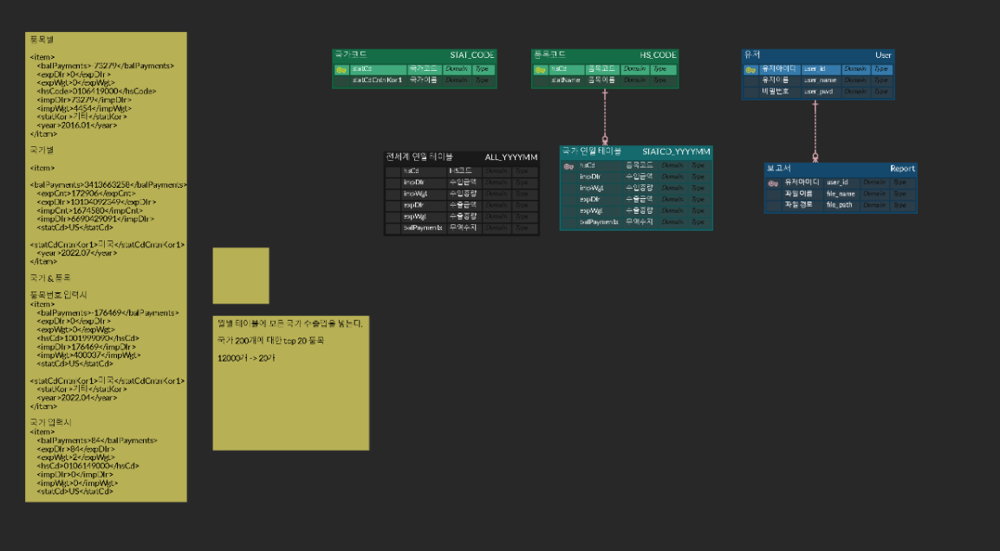

오늘은 로고 만들었지롱

Figma 및 DDD 구현 - 2023.03.07

2023.03.08

[1차 ERD 설계]

- Spring boot도 다시 공부하고 Hadoop도 공부하고 쿠버네티스도 해야 하니 할 게 너무 많은데, 지원할 기업도 엄청 많아서 정신이 없다. 우선순위에 따라서 잘하자.
- RDB가 아닌 Mongo DB로 ERD를 짜려고 하니 정형화된 데이터가 아니어서 고민! 특히 하둡 처리 결과를 바로 어플리케이션에 보낼 수도 있지만 보통 실시간 처리의 경우가 그렇게 구현하도록 한다. 하둡은 실시간 처리에 최적화된 프레임워크는 아님.
- 하둡 분산처리를 데이터 처리 파이프라인에 첨가하려니 시스템 구조도가 어려워져서 고민! 하둡은 실시간 처리가 아니라 주기적으로 처리해두는 프레임워크로 사용한다!
- 머신러닝을 추가하기 위한 방법이 무엇이 있을까?