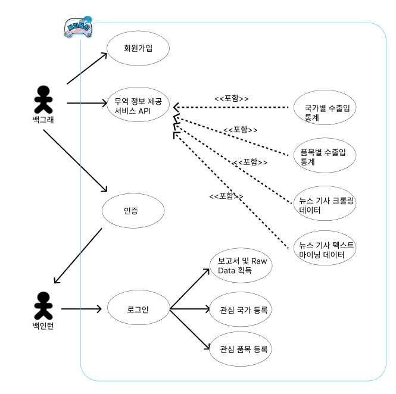

오늘은 로고 만들었지롱

Figma 및 DDD 구현 - 2023.03.07

2023.03.08

[1차 ERD 설계]

- Spring boot도 다시 공부하고 Hadoop도 공부하고 쿠버네티스도 해야 하니 할 게 너무 많은데, 지원할 기업도 엄청 많아서 정신이 없다. 우선순위에 따라서 잘하자.
- RDB가 아닌 Mongo DB로 ERD를 짜려고 하니 정형화된 데이터가 아니어서 고민! 특히 하둡 처리 결과를 바로 어플리케이션에 보낼 수도 있지만 보통 실시간 처리의 경우가 그렇게 구현하도록 한다. 하둡은 실시간 처리에 최적화된 프레임워크는 아님.
- 하둡 분산처리를 데이터 처리 파이프라인에 첨가하려니 시스템 구조도가 어려워져서 고민! 하둡은 실시간 처리가 아니라 주기적으로 처리해두는 프레임워크로 사용한다!
- 머신러닝을 추가하기 위한 방법이 무엇이 있을까?

2023.03.09
[Use case diagram]

사용자의 웹 어플리케이션 서비스를 이용하는 흐름도를 Use case diagram으로 그렸다.

기본적으로 사용자는 무역 정보에 대한 서비스를 GUI 형태로 얻을 수 있다.
국가별, 품목별 수출입 데이터를 얻고 아래에 그래프와 테이블 형식으로 수출입에 대한 정보를 얻을 수 있다.

회원가입으로 인증을 하면 본인만의 보고서를 얻을 수 있도록 할 것이다.
그리고 추가적으로 관심 국가나 품목을 등록하여서 이후에 마이 페이지에서 쉽게 볼 수 있도록 돕는 서비스를 제공하려고 한다.

2023.03.10
[Diagram]

시스템 아키텍처를 설계한다. 기존 CQRS 패턴을 일단 그대로 가지면서 
Jenkins - Ansible로 이어지는 CI/CD 파이프라인을 배치한다. 

추가 구성에 Junit 과정과 만약에 할 수 있다면 쿠버네티스를 포함하는 것이 좋아보인다.
물론 무중단 배포는 카나리, 블루-그린 형태로 Nginx에서 할 수 있는 것으로 보임.